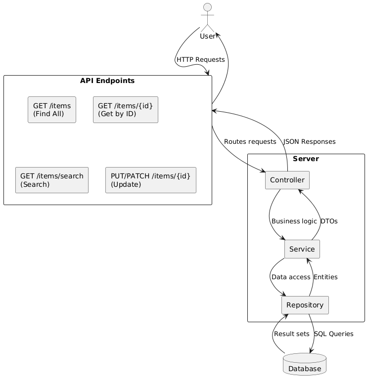

## How To Build and Run
1. Open the project using IDE (developed on Intellij)
2. Build the project
3. Run the main class ```com.mbb.TransactionProcessingApplication```
4. Swagger-UI [http://localhost:8080/swagger-ui/index.html](http://localhost:8080/swagger-ui/index.html)

## High Level Architecture
### Batch job flow (producer)

### REST API (consumer)
